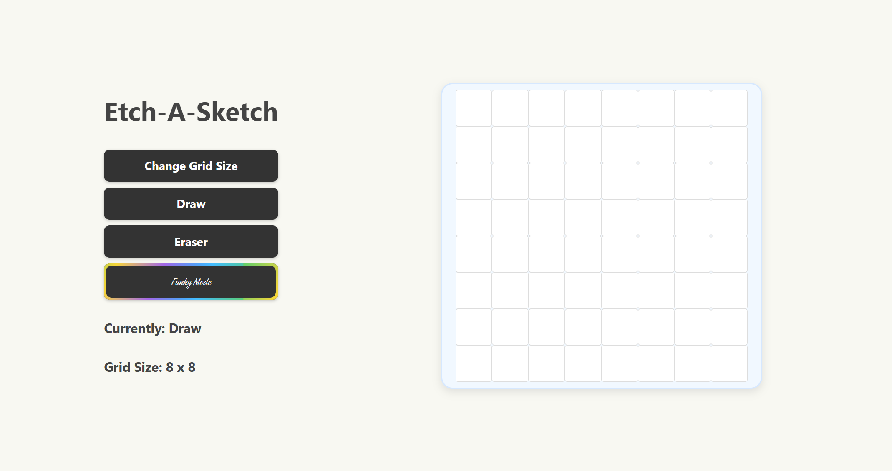

# Etch-a-Sketch

A browser-based Etch-a-Sketch / drawing pad created as part of [The Odin Project's](https://www.theodinproject.com) Foundations curriculum.

## Features

*   **Customizable Grid:** Change the grid size at any time (from 1x1 up to 100x100).
*   **Multiple Drawing Modes:**
    *   **Draw:** Classic drawing with a solid color.
    *   **Eraser:** Return cells to their original state.
    *   **Funky Mode:** Draw with a random color for every cell!
*   **Click and Drag Drawing:** Hold the mouse button down and move it across the grid to draw continuously.
*   **Status Display:** See the current drawing mode and grid size at a glance.

## Technologies Used

*   HTML5
*   CSS3
*   Vanilla JavaScript

## Acknowledgements

*   This project is a solution to the [Etch-a-Sketch assignment](https://www.theodinproject.com/lessons/foundations-etch-a-sketch) from The Odin Project.
*   The animated "Funky Mode" button style was adapted from a design by [SelfMadeSystem on uiverse.io](https://uiverse.io/SelfMadeSystem/strange-cobra-12).